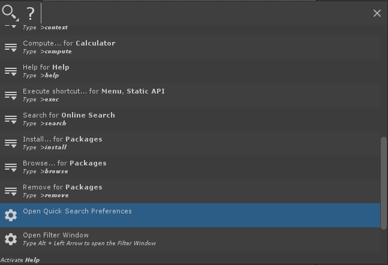
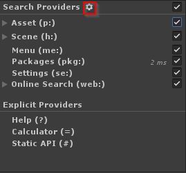
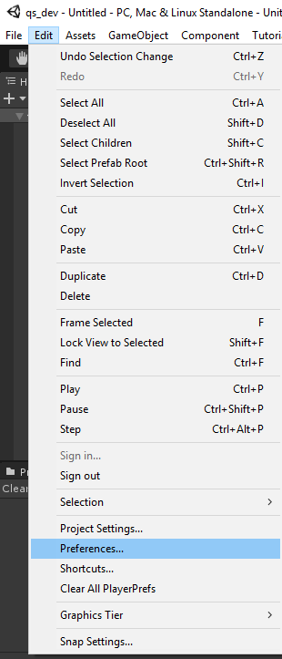
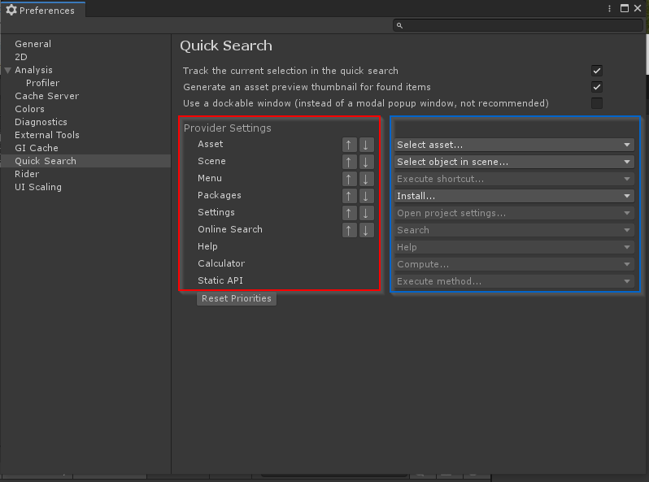
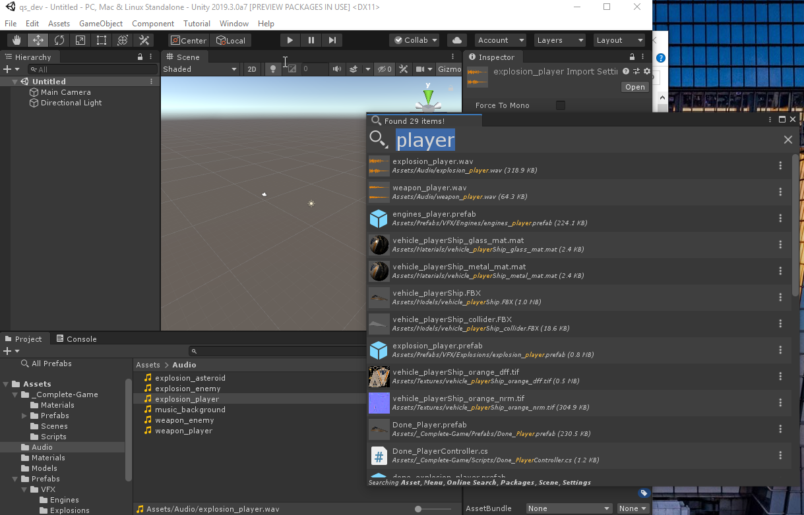

# Quick Search Preferences

## Opening Settings page

There are multiple ways to access the QuickSearch preferences:

type `?` and select Open QuickSearch preferences

Or click the cog icon in the Filter window

Or use the good old edit -> Preferences menu:

## Preference page

The preference page controls all of QuickSearch global settings

### Track the current selection

If this setting is toggled, it means each time QuickSearch selection changed, the `SearchProvider.trackSelection` callback will be executed (see [api](api.md) section). Usually providers will **ping** assets in the Project browser or Hierarchy. Please note that if your project is big this might lead to a slowdown while navigating between search items.

### Generate an asset preview thumbnail

If toggled, we use Unity preview generator to get a thumbnail for each displayed (and only displayed) items. If not toggled we use a generic icon (which is faster in big projects).

### Use dockable window

Will pop the QuickSearch tool in a normal **dockable** Editor Window. That said it is not a recommended workflow has some caching and refreshing done when we close/open QuickSearch might be done less frequently.

### Provider Order

The **red** section in the settings screenshot shows how you can modify the order search items are shown on the screen. You can reorder providers by their relative importance and all items of a higher order provider will appear BEFORE lower order.

### Provider Default action

The **blue** section in the settings screen shows how you can customize what is the default action when pressing `enter` or when double clicking a search item. This is only valid for providers offering multiple actions.

