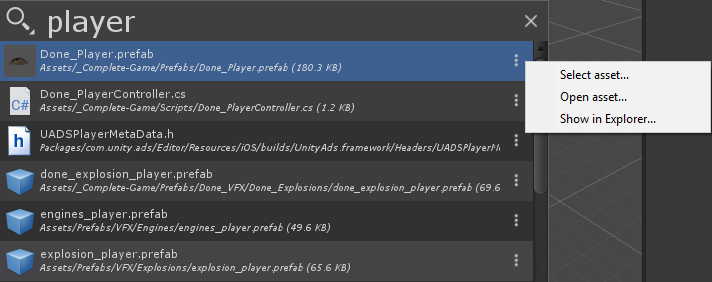

# API

Creating new `SearchProvider` is fairly easy. It basically comes down to providing a function to fetch and search for items and to provide action handlers to `activate` any selected item.

## SearchProvider

 `SearchProvider` manages search for specific type of items and manages thumbnails, description and subfilters. Its basic API is as follows:

```CSharp
public class SearchProvider
{
    public SearchProvider(string id, string displayName = null);

    // Create an Item bound to this provider.
    public SearchItem CreateItem(string id, string label = null, string description = null, Texture2D thumbnail = null);

    // Utility functions use to check if a search text matches a string.
    public static bool MatchSearchGroups(string searchContext, string content);
    public static bool MatchSearchGroups(string searchContext, string content, 
                                        out int startIndex, out int endIndex);

    // Unique id of the provider
    public NameId name;
    // Text token use to "filter" a provider (ex:  "me:", "p:", "s:")
    public string filterId;
    // This provider is only active when specified explicitly using his filterId
    public bool isExplicitProvider;
    // Handler used to fetch and format the label of a search item.
    public FetchStringHandler fetchLabel;
    // Handler to provider an async description for an item. Will be called when the
    // item is about to be displayed.
    // allow a plugin provider to only fetch long description when they are needed.
    public FetchStringHandler fetchDescription;
    // Handler to provider an async thumbnail for an item. Will be called when the item
    // is about to be displayed. allow a plugin provider to only fetch/generate preview 
    // when they are needed.
    public PreviewHandler fetchThumbnail;
    // If implemented, it means the item supports drag. It is up to the SearchProvider 
    // to properly setup the DragAndDrop manager.
    public StartDragHandler startDrag;
    // Called when the selection changed and can be tracked.
    public TrackSelectionHandler trackSelection;
    // MANDATORY: Handler to get items for a given search context. 
    public GetItemsHandler fetchItems;
    // Provider can return a list of words that will help the user complete his 
    // search query
    public GetKeywordsHandler fetchKeywords;
    // List of subfilters that will be visible in the FilterWindow for a given 
    // SearchProvider (see AssetProvider for an example).
    public List<NameId> subCategories;
    // Called when the QuickSearchWindow is opened. Allow the Provider to perform 
    // some caching.
    public Action onEnable;
    // Called when the QuickSearchWindow is closed. Allow the Provider to release 
    // cached resources.
    public Action onDisable;
    // Hint to sort the Provider. Affect the order of search results and the 
    // order in which provider are shown in the FilterWindow.
    public int priority;
    // Called when quicksearch is invoked in "contextual mode". If you return true 
    // it means the provider is enabled for this search context.
    public IsEnabledForContextualSearch isEnabledForContextualSearch;
}
```

Note that since the item list of Quick Search is done using a **virtual scrolling algorithm** some `SearchItem` fields (`label`, `thumbnail`, `description`) are fetched on demand (if not already provided). This means the `SearchProvider` needs to be initialized with specific `Handlers` (`fetchLabel`, `fetchDescription`, `fetchThumbnail`) if you want to populate those fields after the item creation.

### Initialization
`onEnable` and `onDisable` are useful to do caching (or to release resources). They are called when the Quick Search window is displayed.

### Item specific workflow

- `trackSelection`: invoked when an item is selected using the arrow key in Quick Search. Assets and Scene providers will ping the currently selected item.
- `startDrag`: implement this if your item supports dragging. Assets and Scene providers will properly populate the `DragAndDrop` structure with the relevant item UIDs to allow proper dragging.
- `isEnabledForContextualSearch`: when Quick Search is invoked with `Alt Shift + C` we assume a Contextual Search is ongoing. Each provider overriding `isEnabledForContextualSearch` is triggered to see if they should be enabled. As an example:

```CSharp
// Taken from Scene hierarchy provider:
// We want to be part of the contextual search is the currently focused window 
// is the SceneView or the Hierarchy Window.
isEnabledForContextualSearch = () => 
                QuickSearchTool.IsFocusedWindowTypeName("SceneView") || 
                QuickSearchTool.IsFocusedWindowTypeName("SceneHierarchyWindow");
```

### Registering a SearchProvider

Adding a new `SearchProvider` is just creating a function tagged with the `[SearchItemProvider]` attribute. This function must return a new  `SearchProvider` instance:

```CSharp
[SearchItemProvider]
internal static SearchProvider CreateProvider()
{
    return new SearchProvider(type, displayName)
    {
        filterId = "me:",
        fetchItems = (context, items, provider) =>
        {
            var itemNames = new List<string>();
            var shortcuts = new List<string>();
            GetMenuInfo(itemNames, shortcuts);

            items.AddRange(itemNames.Where(menuName =>
                    SearchProvider.MatchSearchGroups(context.searchText, menuName))
                .Select(menuName => provider.CreateItem(menuName, 
                                            Path.GetFileName(menuName), menuName)));
        },

        fetchThumbnail = (item, context) => Icons.shortcut
    };
}
```

By default an `SearchProvider` must have a type (ex: asset, menu, scene...) that is unique among providers and a display Name (used in the Provider filter dialog).

Specifying a `filterId` is optional but it makes *text-based filtering* easier (ex: `p: my_asset`).

### Registering a search provider shortcut

The easiest way to register a possible shortcut for a new provider is to use:

```CSharp
[UsedImplicitly, Shortcut("Help/Quick Search/Assets")]
private static void PopQuickSearch()
{
    // Open Quick Search with only the "asset" provider enabled.
    QuickSearchTool.OpenWithContextualProvider("asset");
}
```

### Performing a search

The bulk of the provider work happens in the `fetchItems` functor. This is  the function a provider creator must fulfill to make an actual search (and filtering). The `fetchItems` signature is:

```CSharp
// context: all the necessary search context (tokenized search, sub filters...)
// items: list of items to populate (if not using the async api)
// provider: the provider itself
public delegate IEnumerable<SearchItem> GetItemsHandler(SearchContext context, 
                                    List<SearchItem> items, 
                                    SearchProvider provider);
```

The `SearchProvider` must add new `SearchItem`s to the `items` list or return an `IEnumerable<SearchItem>`. If you do not use the asynchronous `fetchItems` api, you must return `null` in your `fetchItems` function.

An `SearchItem` is a simple struct:

```CSharp
public struct SearchItem
{
    public readonly string id;
    // The item score can affect how the item gets sorted within the same provider.
    public int score;
    // Display name of the item (optional. If none is provided 
    // SearchProvider.fetchLabel is called)
    public string label;
    // If no description is provided SearchProvider.fetchDescription 
    // will be called when the item is first displayed
    public string description;
    // If true - description already has formatting / rich text
    public SearchItemDescriptionFormat descriptionFormat;
    // If no thumbnail are provider, SearchProvider.fetchThumbnail 
    // will be called when the item is first displayed.
    public Texture2D thumbnail;
    // Search provider user customizable content
    public object data;
}
```
Only the `id` is necessary to be filled.

When doing filtering according to  `SearchContext.searchText` we recommend using the static function `SearchProvider.MatchSearchGroup` which makes partial search.

If you want to use fuzzy search on an item, you can use `FuzzySearch.FuzzyMatch`:

```CSharp
if (FuzzySearch.FuzzyMatch(sq, CleanString(item.label), ref score, matches))
    item.label = RichTextFormatter.FormatSuggestionTitle(item.label, matches);
```

All search items are sorted again item of the same provider with their `score`. The **lower score** will appear at the top of the item list (**ascending sorting**).

### Asynchronous Search API

If your search provider can take a long time to compute its results or rely on asynchronous search engine (ex: WebRequests) you can return an `IEnumerable<SearchItem>` from your `fetchItems` function. Your `IEnumerable<SearchItem>` should be a function that yields results, so that the api can fetch one item at a time.

When an `IEnumerable<SearchItem>` is returned, the enumerator is stored and iterated over during an application update. Furthermore, we constrain the iterating time to ensure the UI is not blocked. However, since the call is in the main thread, you should make sure to yield as soon as possible if your results are not ready. The enumeration continues over multiple application updates until it is done.

Here is an example using the asynchronous `fetchItems` api:

```CSharp
public class AsyncSearchProvider : SearchProvider
{
    public AsyncSearchProvider(string id, string displayName = null)
        : base(id, displayName)
    {
        fetchItems = (context, items, provider) => FetchItems(context, provider);
    }

    private IEnumerable<SearchItem> FetchItems(SearchContext context, SearchProvider provider)
    {
        while(ResultsNotReady())
        {
            yield return null;
        }

        var oneItem = // Get an item
        yield return oneItem;

        var anotherItem = // Get another item
        yield return anotherItem;

        if(SomeConditionThatBreaksTheSearch())
        {
            // Search must be terminated
            yield break;
        }

        // You can iterate over an enumerable, the enumeration will
        // continue where it left.
        foreach(var item in someItems)
        {
            yield return item;
        }
    }
}
```

The Quick Search package contains 2 examples with async results:

- `com.unity.quicksearch/Editor/Providers/Examples/AssetStoreProvider.cs` : which provide a way to query the asset store using WebRequest.
- `com.unity.quicksearch/Editor/Providers/Examples/ESS.cs`: which creates a process to start the EntrianSource search indexer to provide full text search for assets in your project.

### Registering an Action Handler

Actions can be registered for a specific provider. These actions buttons will be drawn next to the `SearchItem` of the specified provider type:



Since registering an action handler is a different process than registering a provider this means you can register new action handlers for existing providers (mind blown)!

Here is an example of how to register actions for the Asset provider:

```CSharp
[SearchActionsProvider]
internal static IEnumerable<SearchAction> ActionHandlers()
{
    return new[]
    {
        new SearchAction("asset", "select", Icons.@goto, "Select asset...")
        {
            handler = (item, context) =>
            {
                var asset = AssetDatabase.LoadAssetAtPath<Object>(item.id);
                if (asset != null)
                {
                    Selection.activeObject = asset;
                    EditorGUIUtility.PingObject(asset);
                    EditorWindow.FocusWindowIfItsOpen(
                        Utils.GetProjectBrowserWindowType());
                }
            }
        },
        new SearchAction("asset", "open", SearchIcon.open, "Open asset... (Alt+Enter)")
        {
            handler = (item, context) =>
            {
                var asset = AssetDatabase.LoadAssetAtPath<Object>(item.id);
                if (asset != null) 
                    AssetDatabase.OpenAsset(asset);
            }
        },
        new SearchAction("asset", "reveal", SearchIcon.folder, "Show in Explorer")
        {
            handler = (item, context) =>
            {
                EditorUtility.RevealInFinder(item.id);
            }
        }
    };
}
```

Basically you create a function tagged with the `[SearchActionsProvider]` attribute. This function must return an `IEnumerable<SearchAction>`.

An `SearchAction` describe and action and provide a handler to execute the action on a specific `SearchItem`

```CSharp
public class SearchAction
{
    public SearchAction(string providerType, string name, 
                        Texture2D icon = null, 
                        string tooltip = null);
    public ActionHandler handler;
    public EnabledHandler isEnabled;
}
```

`providerType` is the provider unique id for which you are registering the action.

`ActionHandler` is of the following signature:

```CSharp
// item: item that needs the action to be executed.
// context: search context of the SearchTool when the item is executed.
public delegate void ActionHandler(SearchItem item, SearchContext context);
```

An action can be setup with a `isEnabled` predicate that will decide if the action is available (i.e. enabled) for a specific item.

### Contextual Search Action

If you register an action named `context` for a specific provider, it means this provider supports **right click** on its item. You then have the possibility of popping a more specific menu item. This is an example taken from the Asset Action provider:

```CSharp
new SearchAction(type, "context", null, "Context")
{
    handler = (item, context) =>
    {
        var asset = AssetDatabase.LoadAssetAtPath<Object>(item.id);
        if (asset != null)
        {
            Selection.activeObject = asset;
            EditorUtility.DisplayPopupMenu(
                QuickSearchTool.ContextualActionPosition, 
                "Assets/", null);
        }
    }
}
```
