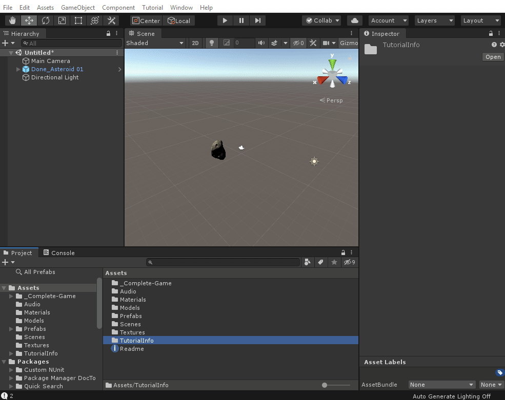
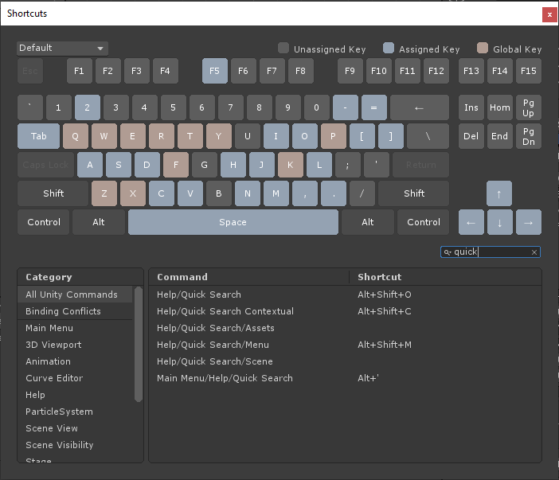
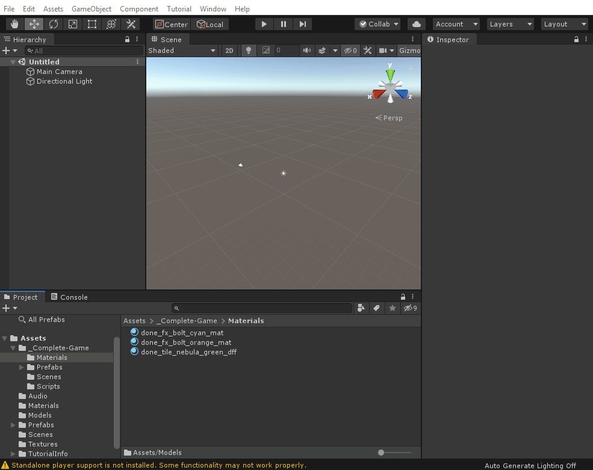

# Unity Quick Search

Search anything in Unity!

Using the shortcut `Alt + ' ` or the `Help -> Quick Search` menu will bring out the QuickSearch Tool. This extensible tool allows you to search multiple areas of Unity.

Feel free to use the Shortcut Manager to rebind the Quick Search actions to your preferred key sequence:

## Help me please

Since a lot of the functionalities of QuickSearch are available via shortcut or by using special *search tokens* you might not harness the full power of Quick Search in your first uses. Don't hesitate to type `?` in the search area to trigger the *Help Search Provider* which will help you discover more cool features about Quick search.

