# Search Providers

Quick Search comes with a lot of providers that indexed multiple parts of Unity. See the [api](api.md) section if you want to create your own provider.

## Assets

All assets in the current project are available for search. We use our own asset indexer (different than the AsetDatabase or the Project Browser) but that yields results way faster.

From an asset item you can apply the following actions:

- Select the asset (in the Project browser)
- Open the asset (using an external editor if necessary)
- Show in Explorer (or Finder)

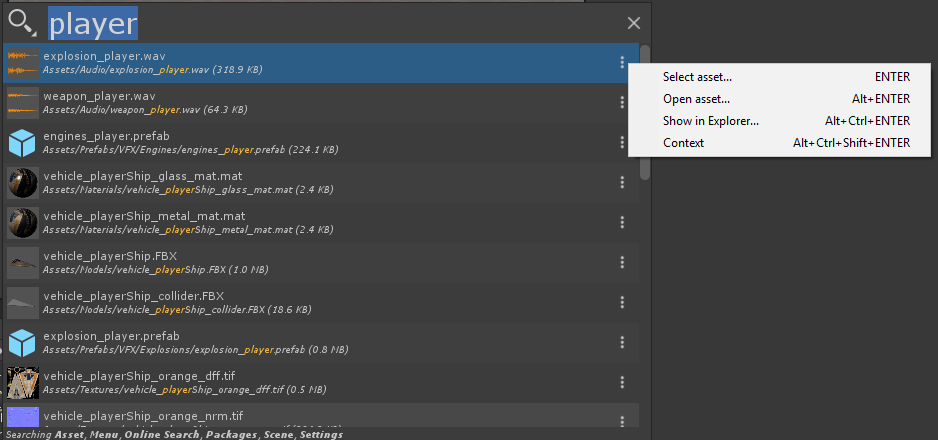

You can disable packages Search using the Asset provider specific filter:

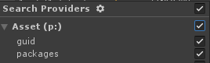

You can also support search by GUIDs (instanceIDs)

### Difference from AssetDatabase Search

The Asset Provider doesn't recognize the type (ex: `t:Scripts) or label (l:Terrain) filters. But it is much more flexible:

- You can type **file extension** and it will find all assets
- It does matching against directory name
- It does partial search
- It is much faster!

### Use the AssetDatabase search

If you want to rely on the AssetDatabase search (completely bypassing our fast asset indexer) just use any AssetDatabase search tokens like `t:` or `l:`:

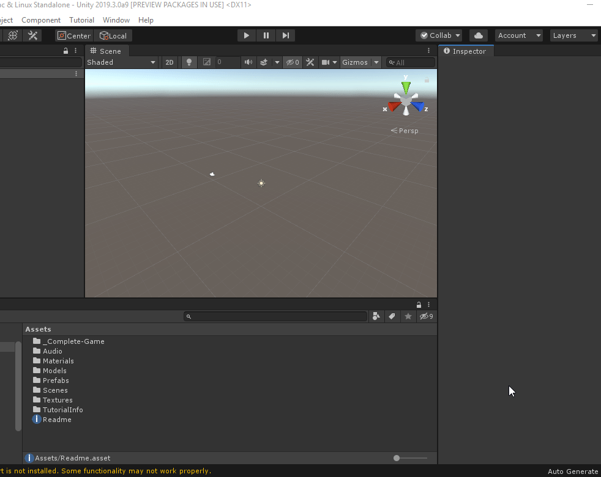

Notice how Quick Search uses Auto completion to suggest the supported filter.

### Searching the file system

If you use the `*` on a query it will perform a normal search AND a wildcard search against the file systems (allowing you to track files not indexed by the AssetDatabase).

### Searching by GUIDs

The Asset search provider supports searching with GUIDs:

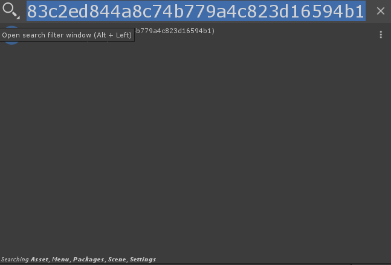

## Current Scene

All GameObjects in the current scene are available for search. Activating a scene item in the Quick Search tool will select the corresponding GameObject in the Scene.

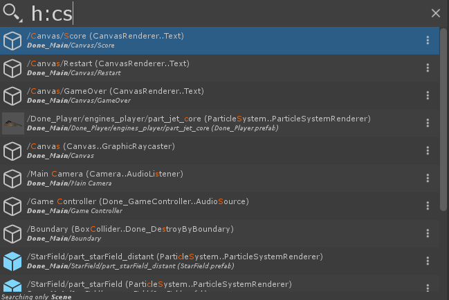

By default Search in Scene are done with a fuzzy search. Notice how 
`/Canvas/Score/` matches the search query `cs`. Using fuzzy search is a bit more costly than a direct search so it might be slower in bigger scenes. If you want to disable Fuzzy Searching use the Quick Search Filter Window:

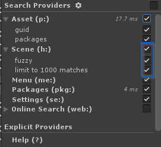

## Menu

Each menu item in Unity is available within Quick Search. This is especially useful to pop that elusive Test Runner or the Profiler!

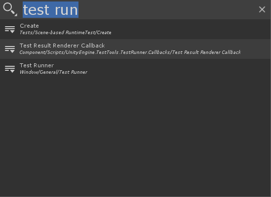

## Settings

Each Project Setting or Preferences page is available for search. The Quick Search Tool will open the Unified Settings Window at the required page.

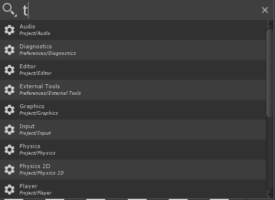

## Packages

The Package Search Provider allows you to search for any existing packages and install, update it or remove it.

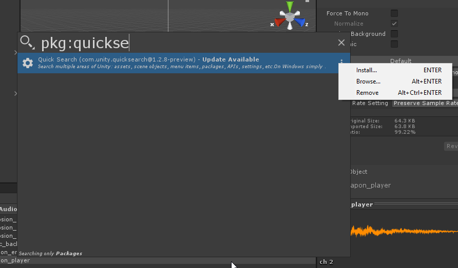

## Online Search Providers

We have a `SearchProvider` that allows to search various Unity websites. Using this provider will open your default browser at a specific Unity page and perform a search and display some results. You can search the following websites and it is very easy to add new web search providers:

- [answers.unity.com](answers.unity.com)
- [The Official Unity Documentation](docs.unity3d.com/Manual)
- [Scripting Reference](docs.unity3d.com/ScriptingReference)
- [The Mighty Unity Asset Store](assetstore.unity.com)

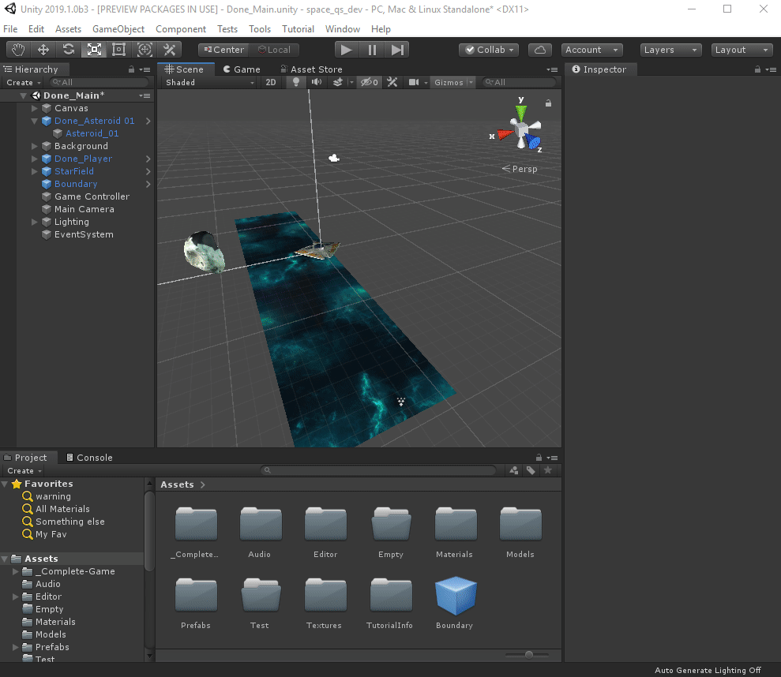

# Explicit Providers

Explicit providers are **only** queried for when their *filter id* is used. Thus when doing a normal search their results won't appear in the item list.

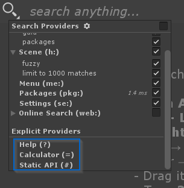

## Calculator (=)
Using the token `=` will trigger the calculator. You can enter any expression valid in our different numerical textfields. The result will be printed directly. Selecting the item will print the result in the console and in the clipboard.

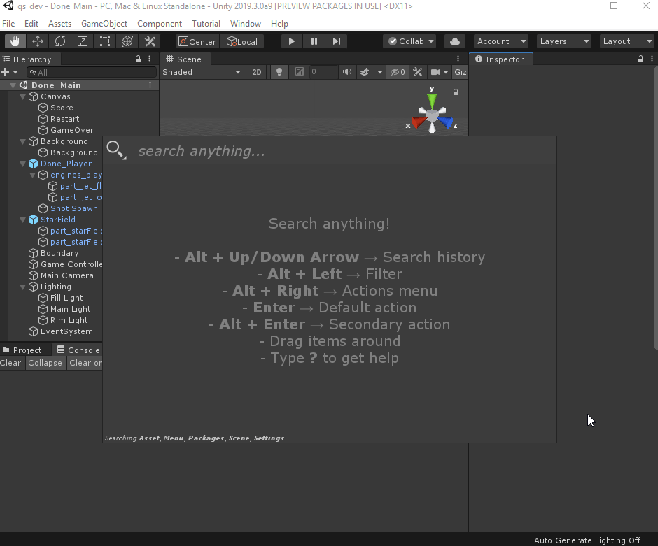

## Static API (#)

This clever search provider indexed all **public static API of Unity** and make them available for *execution*:

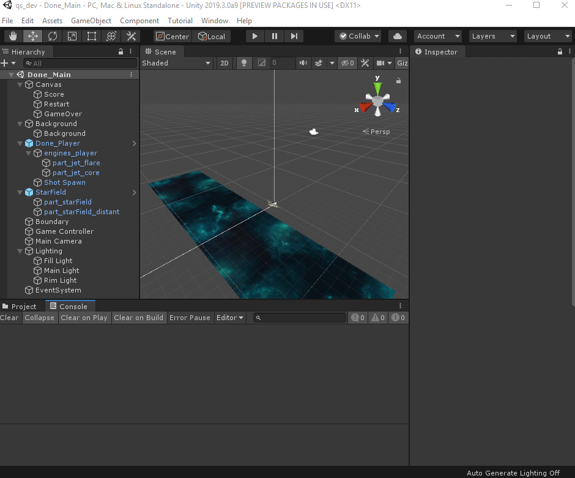

## Command Query (>)

Command Query is a special provider that can be triggered using `>`. It works backward to the normal search workflow: instead of typing a search query and then select a specific action to apply on an item, you type a **specific action** (with autocompletion) and it will filter **only** items supporting this specific action.

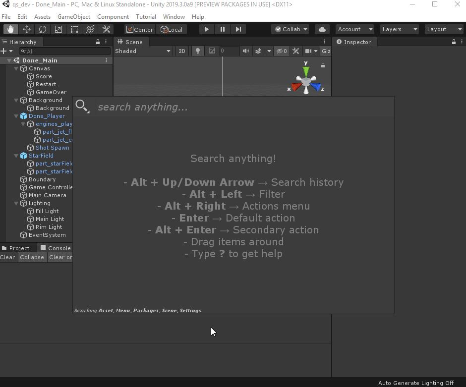
