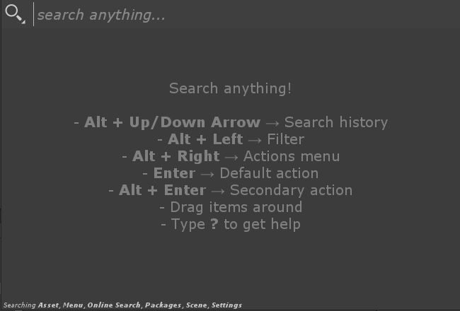
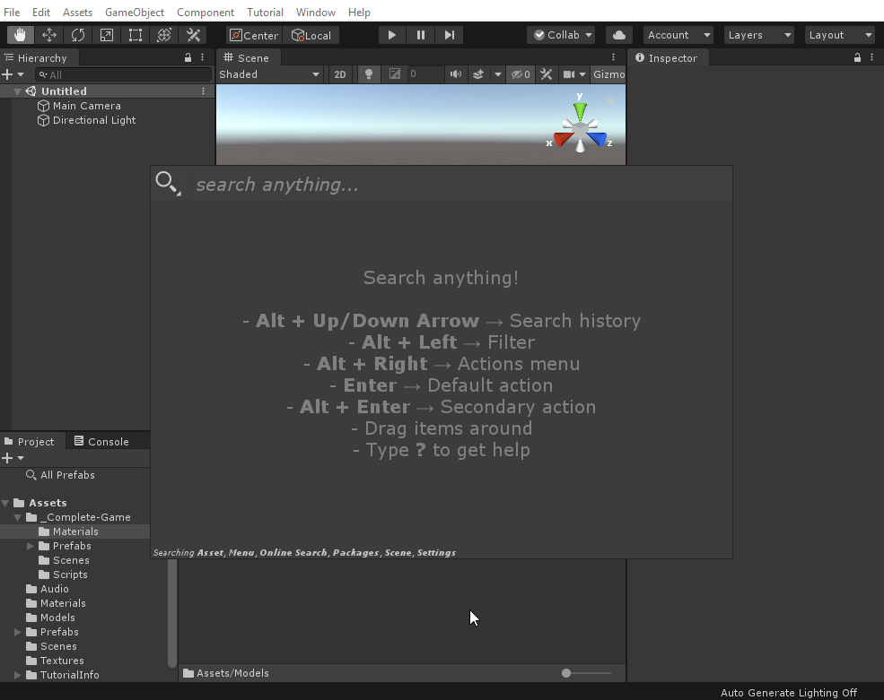
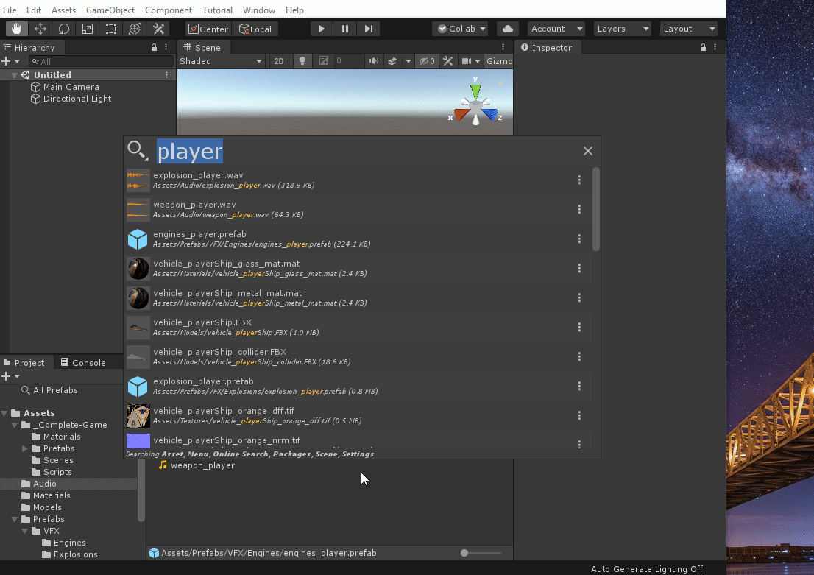
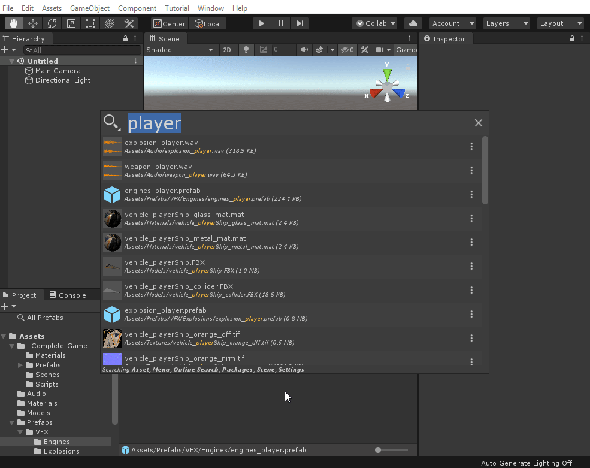
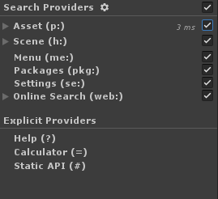
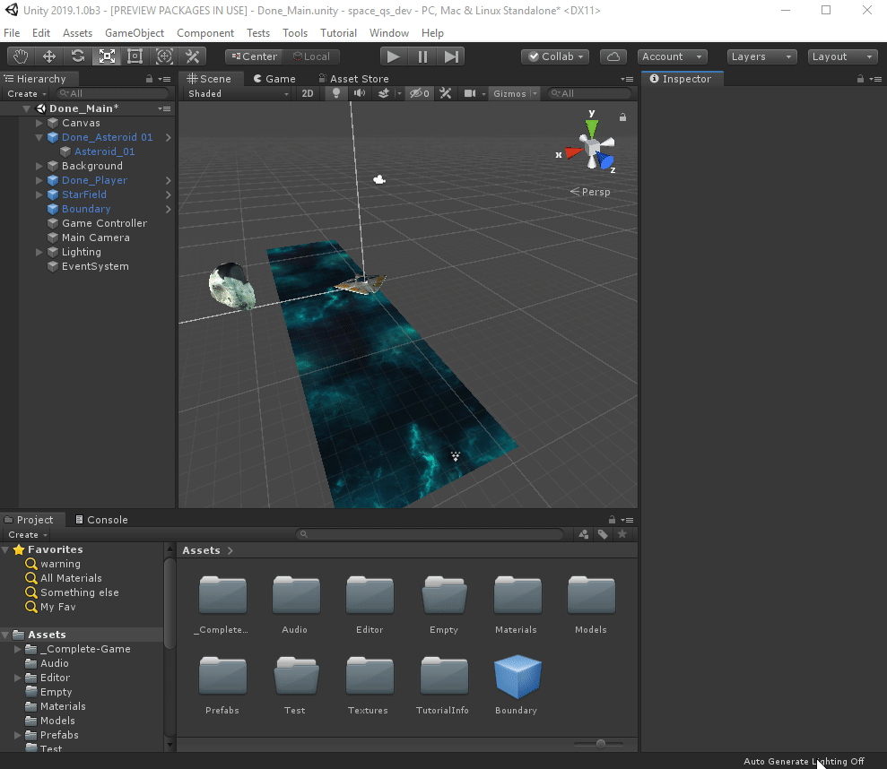
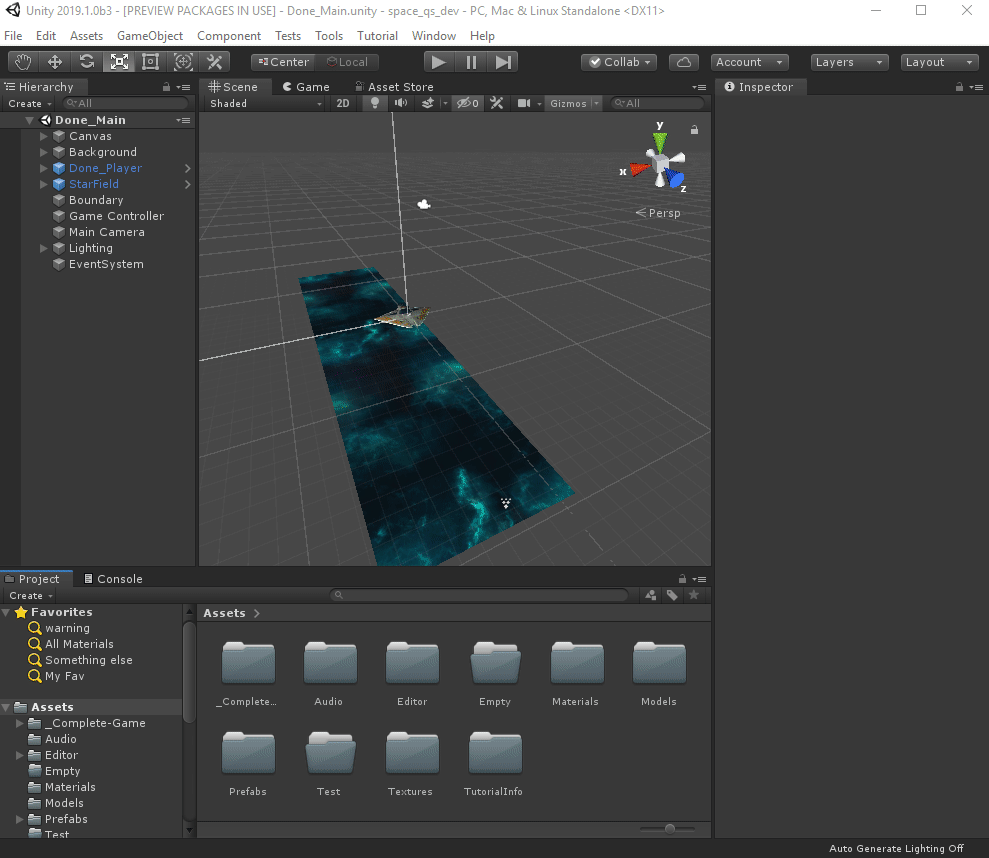
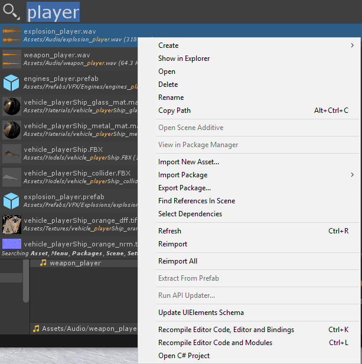

# Usage

Quick Search packs a lot of punches and has a lot of hidden features. This section explains all workflows Quick Search is capable of.

## How to Open Quick Search

The more generic way of opening Quick Search is:

- `Alt + '` : It opens Quick Search in the same state it was the last time you used it. *The filter configuration and last search are preserved.*

There are multiple ways to open Quick Search when you want to specifically look for a **type** of items.

- `Alt + Shift + M` : Search **only** for Menu items
- `Alt + Shift + C` : Contextual search. If the *Hierarchy View* has the focus, it searches for Scene items. If the *Project Browser* has the focus, it searches for assets. If any other view has the focus, Quick Search is open as normal.

## Keyboard Navigation

All the features of the Quick Search tool can be accessed using the keyboard. Some of these shortcuts are explained on the Quick Search introduction screen (available when no text is in the search area):

The Search box is *always focused* and you can type even with an element selected.
- `Alt + Left Arrow` : Toggle the Filter view
    - Using `Up Arrow`, `Down Arrow` in the Filter view cycle between filters.
    - Using `spacebar` toggle a filter

- `Alt + Right Arrow` : Pop the action selection menu if the selected item has multiple actions available.

- `Enter` :  default action on selected item
- `Alt + Enter` : Secondary action on selected item
- `Alt + Ctrl + Enter` : Third action on selected item
- `Alt + Ctrl + Shift + Enter` : Fourth action on selected item

- `Alt + Up Arrow` or `Alt + Down Arrow` navigate through the search history:

## Provider Filters

Those filters define which Search Providers are available for a search. This can help reduce the number of items return by a search query especially if you know what type of item you are looking for:

The Filter window allows you to customize which providers are available for a search. Note that the filter is kept in the same state each time you open Quick Search.

### Provider text filters
From the Quick Search Box you can type a search provider `filter id` that will restrain the search to **this specific provider**. The `filter id`s are:

- Asset (i.e. Project Browser): `p:`
- Menu: `me:`
- Scene (i.e. Hierarchy): `h:`
- Packages: `pkg:`
- Settings: `se:`
- Online Search: `web:`

Examples of queries using text providers:

- `p:Player` : Search assets containing "Player"
- `h:Main Camera` : Search scene for GameObjects with "Main Camera" in their name
- `me:Test Runner` : Search menu items for Test Runner
- `se:VFX` : Search settings (project and preferences) for VFX

## Drag and Drop

Asset and Scene items allow dragging from the Quick Search window to anywhere that supports it (hierarchy view, game view, inspector, etc.):

## Right click menu

Some items (i.e. Asset) support right clicking and will show the expected contextual menu.

## Search Results Ordering

Quick Search supports a clever "scoring" system per items. This means some items who better match a query will be prioritized.

Quick Search also learns with you as the "score" of an item will be bumped if it is often selected!

See the [settings](settings.md) section to learn how to customize search ordering between different providers.
